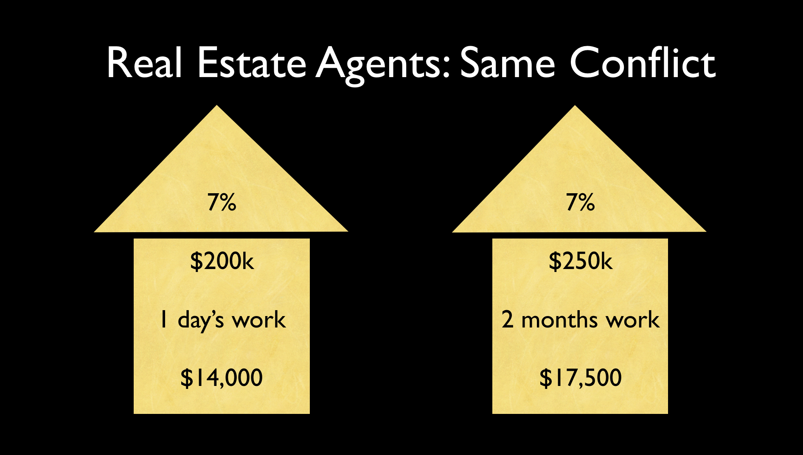
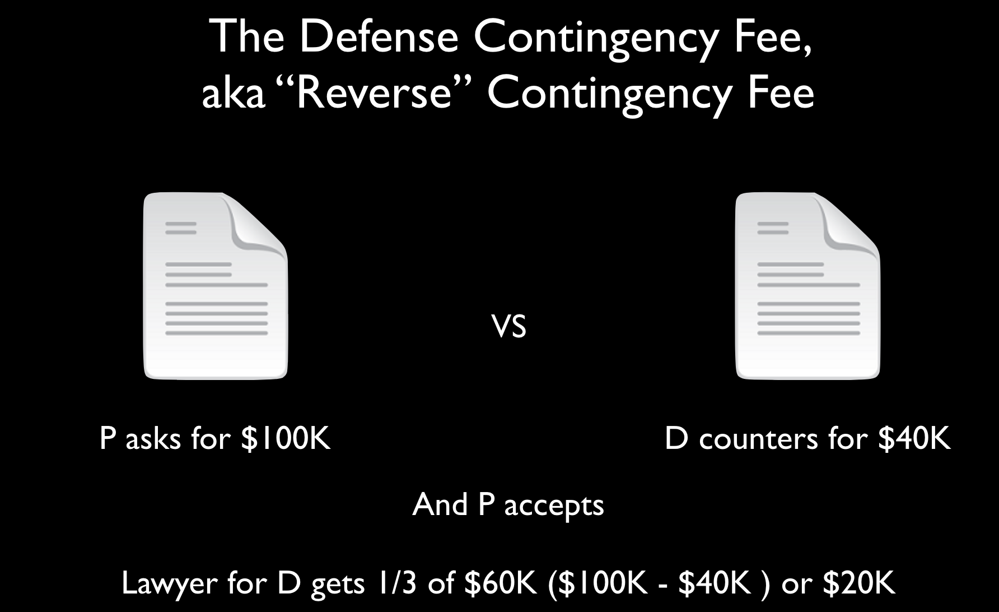
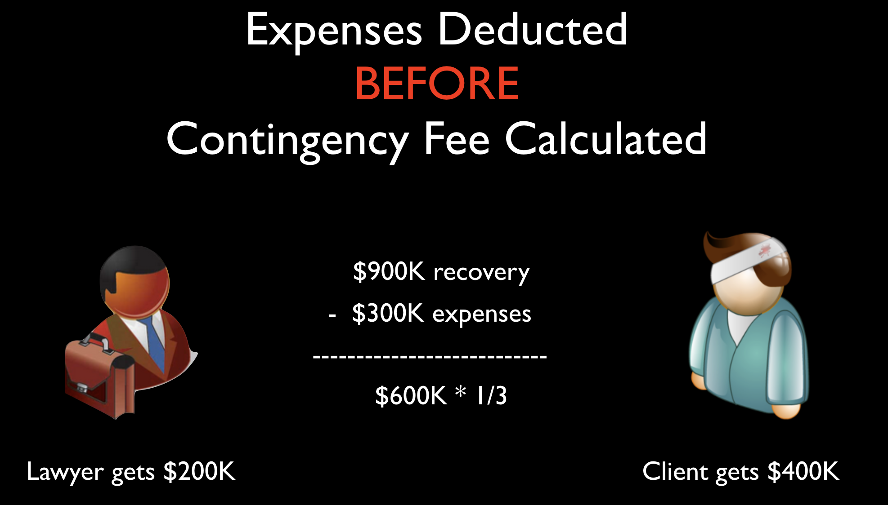
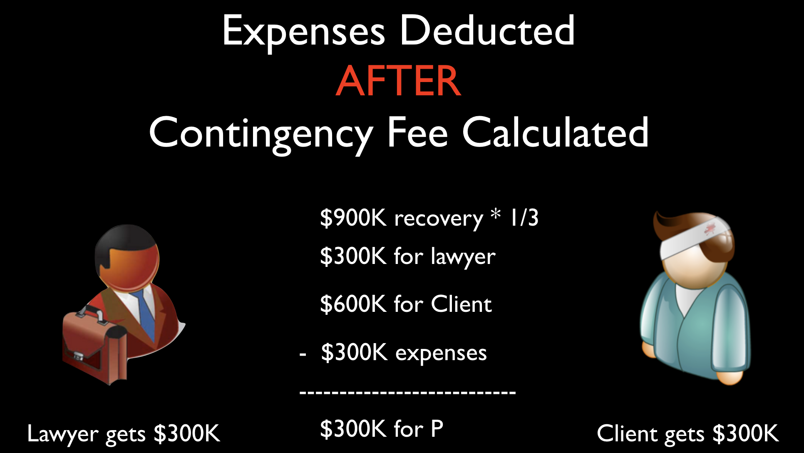

---
author: Richard Dooling
title: Legal Profession
subtitle: MF Chapter 12
main rules: 1.5, 1.15
doc: slide notes
---

# M&F4TH Chapter 12 

## Fees and Client Property

Fox's rant about hourly fees can lead to a good discussion about the conflicts apparent in hourly fee arrangements.

Model Rule 1.5(a) applies the reasonableness standard to fees as well as expenses. 

Both ABA Formal Opinion 94-389 teaches that lawyers may not always rely on an initial contract bargain, 
especially if the lawyer did a poor job of explaining the fee up front. 
However, the ABA Opinion also concludes that, 
even where liability is clear and some recovery is certain, 
a contingent fee can be ethically proper. 

### The Hourly-Rate Fee

What is the second most important question to ask if you are the client being told about an hourly fee arrangement?

First, how much do you charge per hour? Let's say that $200 per hour is reasonable. Okay, next question: What is your firm's smallest increment of billable time? If the firm bills by the quarter hour, then a 4-minute phone call is billed as one-fourth of an hour, or $50. More likely, firms bill by six-minute increments, or tenths of an hour. This is more fair, but good lawyers will tell you that they forget about more phone calls than they bill. 

No surprise that your bosses will expect you to bill for all of your time, and then they'll decide whether it needs a adjustment, not you. But in fact, most lawyers do their own adjustments on the front end. 

Hourly billing results in perverse incentives: The longer it takes, the more the lawyer gets paid.
See Fox's rant about billable hours.

Must the lawyer run down every citation and file every motion, 
even if it would be cost-effective for the client to do less?
If the lawyer is arguing a point in the brief, must he cite 10 or 20 cases showing overwhelming authority?
Or is one controlling case, on all fours for each question presented enough? 
A 10-page memo instead of a 50-page memo.

The overarching command is that *fees must be reasonable.*
Look at Rule 1.5(a) and the 8 factors.
The old Model Code used to prohibit "clearly excessive fees."
Now, the Model Rules impose an affirmative obligation of a *reasonable fee*.

The client is an educated professional. She knows what other lawyers charge, but she sticks with Novak.

Any fee arrangement creates incentives that benefit the lawyer and disadvantage the client. 
A lawyer paid a *flat fee* has an incentive to settle quickly.
A lawyer paid *by the hour* has an incentive to over-prepare.
What if the lawyer agrees to handle the case for a 1/3 contingency fee, 
but there is little to do, other than filing the insurance claim?

What if a lawyer does work normally done by assistants or paralegals, 
but bills out at his own hourly rate?
Large firms can abuse the billing privilege 
by assigning three partners to write and edit the perfect memo.
Or the $400 per hour partner billing for summarizing a deposition?
Usually corporate clients pay enough attention to discourage outright padding, 
but still the anti-client incentives are there.

Lawyers can recognize the conflicts and explain them to the client, but probably cannot solve the conflicts.
Lawyers are like the proverbial barbers who always say "Yes!" when their clients ask: "Do I need a haircut?" 

"Is litigation good for both of us?" 
Or just for the lawyer who gets to bill liberally for the privilege?

It is always “helpful to consider these questions, not from the perspective of what a client could be forced to pay, but rather from the perspective of *what the lawyer actually earned*."

### Model Rule 1.5(a)

A lawyer shall not make an agreement for, charge, or collect an unreasonable fee or an unreasonable amount for expenses. The factors to be considered in determining the reasonableness of a fee include the following:

(1) the time and labor required, the novelty and difficulty of the questions involved, and the skill requisite to perform the legal service properly;

(2) the likelihood, if apparent to the client, that the acceptance of the particular employment will preclude other employment by the lawyer;

(3) the fee customarily charged in the locality for similar legal services;

(4) the amount involved and the results obtained;

(5) the time limitations imposed by the client or by the circumstances;

(6) the nature and length of the professional relationship with the client;

(7) the experience, reputation, and ability of the lawyer or lawyers performing the services; and

(8) whether the fee is fixed or contingent.

Model Rule 1.5 Comment 3: "It is proper to define the extent of services in light of the client’s ability to pay."

Model Rule 6.1 "Voluntary Pro Bono Publico Service" Comment 6 encourages "substantially reduced fee for services" for poorer people.

Courts and disciplinary counsel are much harder on lawyer who springs the high fee on the client with no warning after the work is done.

### The Pressure To Bill Time

Personally I prefer to experiment with other fee arrangements, because billing by the hour is not good for clients. 
However, lawyers who work in firms usually must abide by firm billing practices. 

### History of “Billable Hours”

* 50 years ago: 1200-1500 hours per year
* 40 years ago:
* partners: 1200-1400 hours per year
* associates: 1400-1600 hours per year
* 1980s: NYC firms 1800 hours per year
* 1990s: 1900-2000
* Today? 

Lawyers bill about two hours for every three hours they are at work. 
Some lawyers are more focused, work with their doors closed, and truly manage to bill seven out of eight, but that is not the norm. Too many other things happen during the day, including vacations, sick leave, personal leave, funerals, caring for family members, family doctor appointments.

Thus, to bill 2,000 hours per year, a lawyer will spend about 60 hours per week at the office and take no more than 2 weeks off.

* 2000 hours ÷ 50 weeks = 40 hours billable, or 60 hours per week total
* 10 hours per day, 6 days per week

Really? That is the question. Young associates must be vigilant and push back, when possible, against the constant pressure to bill more hours. Sometimes firms pressure in this way, even when there is not enough work to keep everybody busy. Then the temptation is to make some work to do.

So I go into this, not because I am telling that lawyers shouldn't bill 60 hours a week. That is fine, as long as those hours are real and the work was actually done. The fear is that relentless pressure to bill leads to padding.

So it pays to keep in mind what the sixty-hour week would look like.

#### The Sixty-Hour Week

* 10 hours per day, 6 days per week
* Add transportation time (45 minutes x 2)
* You leave home at 7:45 am. 
* Work from 8:30 a.m. until 6:30 p.m.
* Arrive home at 7:15 p.m.

Do this six days per week, every week, not just for a month or two, but year after year. 

#### Model Rule 6.1 

###### Voluntary Pro Bono Publico Service

Now that the lawyer has been worked to death, let's add that every lawyer has a professional responsibility to provide legal services to those unable to pay. A lawyer should aspire to render at least (50) hours of pro bono publico legal services per year &hellip; 

Again, I prefer to encourage, not demand. Lawyers should accept appoints and pro bono work, because it's the right thing to do, but it's also a great way to gain experience. 

#### The Fee Contract 

Remember the old contract rule: 
Courts put themselves in the shoes of the party *at the time the contract was made*.

If lawyer wants to adjust the fee, 
is it because something unforeseeable has caused a catastrophic increase in the amount of work required to achieve the client's original goals?

The lawyer usually assumes the risk that the fee agreement will work out better or worse.

The Restatement &sect; 34 says that post-contract events can be considered in evaluating the fee.
Only events not reasonably foreseeable at the time of the original contract may be considered.

### Informed Consent

When do we judge the reasonableness of the fee arrangement?
Rule 1.4(b) “A lawyer shall explain a matter . . . to permit the client to make informed decisions . . .”

#### Presenter Notes: 

Model Rules don’t speak directly to this issue. Just because the fee seems high after the fact should not always mean it was “clearly excessive” or that it “shocks the conscience.”

Could be a Rule 1.4 Communication Problem instead of a Rule 1.5 Fee problem

ONE POSSIBLE STICKLER, 

Unsophisticated clients need extra help understanding fee agreements. 
Examples help. “So, if we settle the case next week, 
our firm still gets a third of your recovery. 
If that seems somehow unfair to you, then you should tell me now &hellip;”

If lawyer was not candid with this client or did not candidly describe the merits of settling, then 
his problem is not only the size of fee, but his honesty with his own client

How do the parties deal with each other, Yes, but also how the industry deals with these situations as a whole.

This is the part of the knowledge that makes it dangerous for a lawyer with no publishing or entertainment law experience to start mucking around in a publishing contract or a contract for personal services in the film industry.

### Contingency Fees 

Why do contingent fees get a bad name?
What exactly is the problem?
Is billing by the hour better for the client?

Entertainment lawyers often bill by taking 5% of their clients income. 
They bill the way agents and managers bill, by taking a cut. 
Certain near perfect efficiencies are the result. The lawyer’s and client’s interest are almost perfectly aligned: The more the lawyer gets for the client, the more the lawyer gets.

Do contingent fee cases encourage clients to bring bad cases?
It is hourly rate lawyers who have the incentive to pursue losing cases and run up hours.
But lawyers charging contingent feels must constantly evaluate the prospects of their cases. 

Clear incentive not to waste time.

One third of nothing is nothing.  The incentive effect of the contingent fee should not be dismissed lightly

#### Contingent Fee Conflicts

In a personal injury suit, lawyer agrees to take a contingency fee of 33%.
Before lawyer begins work, other side has offered $15K in settlement.
Lawyer suspects a jury would award $60K, but it would take at least 200 hours of work to get in front of a jury. 
The lawyer may be tempted to take $5K for doing nothing, rather than work for 200 hours to get $15K, but that would not be in the client's best interest.

Real Estate agents do the same thing. 

If Randy Real Estate Agent sells your Harry Homeowner's house in one day for 200,000 at 7% commission, the agent gets $14k for a day's work.

If the agent instead works hard for three months, holding open houses, advertising, and doing showings, and then sells Harry's house for $250k at 7% commission, the agent gets $17.5k, only about $3k more for all of that work.



Everybody in the business should be alert to these conflicts, but sometimes they aren't, and it's the lawyer's job to watch out for them, and if necessary explain them to unsophisticated client.

#### The Defense Contingency Fee

###### aka “Reverse” Contingency Fee 

Defense counsel’s fee would be one-third of the difference between the prayer in the petition and the amount actually awarded.

* P asks for $1 million. 
* Defense counsel litigates and convinces P to settle for $400k.
* D pays fee of $200k to lawyer ($1M - $400k = $600k/3).

It is the mirror image of the person injury arrangement. 

ABA Standing Committee has said, “contingent fees for defense counsel in civil cases do not violate the Model Rules provided the amount saved is “reasonably ascertainable,” 

The total fee is reasonable, and the client’s consent is “fully informed.”




### Creative Fee Idea

Suppose the law required personal injury lawyers to ask the defendant to make an offer of settlement *early*.
If the offer is accepted, the plaintiff’s lawyer would have to bill based on hours worked and total fee is no more than 10% of the recovery. If offer is rejected, the plaintiff’s lawyer charges a contingent fee on (the Total Recovery minus the Initial Offer).


### Contingent Fee Agreements

Must be in writing signed by the client and shall state 
the method by which the fee is to be determined, including the percentage or percentages that shall accrue to the lawyer in the event of settlement, trial or appeal; 
litigation and other expenses to be deducted from the recovery; 
and whether such expenses are to be deducted before or after the contingent fee is calculated. 
The agreement must clearly notify the client of any expenses for which the client will be liable whether or not the client is the prevailing party.

#### Expenses Deducted From Recovery When?

Lots of expenses: Word processing, photocopying, messengers, overnight postage, experts, travel, exhibits, you name it. Can be hundreds of thousands of dollars, or more in mass torts and the like.

Expenses deducted *before* or *after* 1/3 contingency fee is calculated?

Imagine a $900,000 recovery. Expenses are $300k

Does lawyer get $200k or $300k?

In engagement letter, give client examples of recovery and contingency and expenses.

#### Expenses Deducted Before

>   $900K recovery
>-  $300K expenses
>---------------------------
>   $600K * 1/3 = $200k



#### Expenses Deducted After

>   $900K recovery * 1/3
>   $300K for lawyer
>   $600K for Client
>-  $300K expenses
>---------------------------
>   $300K for P



In engagement letter, give client examples of recovery and contingency and expenses.

### Prohibited Contingency Fees

#### Model Rule 1.5(d) 

A lawyer shall not enter into an arrangement for, charge, or collect:

any fee in a domestic relations matter, the payment or amount of which is contingent upon the securing of a divorce or upon the amount of alimony or support, or property settlement in lieu thereof; or
 a contingent fee for representing a defendant in a criminal case.

Model Rule 1.5, Comment (e), prohibited contingent fees:

Paragraph (d) prohibits a lawyer from charging a contingent fee in a domestic relations matter when payment is contingent upon the securing of a divorce or upon the amount of alimony or support or property settlement to be obtained.

This provision does not preclude a contract for a contingent fee for legal representation in connection with the recovery of post-judgment balances due under support, alimony or other financial orders because such contracts do not implicate the same policy concerns.

### Model Rule 1.5(e)

###### Division of Fees

A division of a fee between lawyers who are not in the same firm may be made only if:

(1) the division is in proportion to the services performed by each lawyer or each lawyer assumes joint responsibility for the representation;

(2) the client agrees to the arrangement, including the share each lawyer will receive, and the agreement is confirmed in writing; *and*

(3) the total fee is reasonable.

### Non-refundable or general retainer?

#### Model Rule 1.5(a)(2) 

Some lawyers are in such demand that they may be paid to be on stand-by. Look at one of the reasonableness factors “the likelihood if apparent to the client that acceptance of the particular employment will preclude other employment by the lawyer.”

A wealthy client or giant corporation may pay the lawyer “Set aside the month of May for me.”
This might constitute what is called an engagement retainer or "general retainer."

Like pay or play provisions in Hollywood. 

In a general retainer or engagement retainer, the attorney provides some benefit to client in exchange for the retainer (by setting aside time, giving the client priority, turning away other business).

When a client pays an atty before the atty provides legal services, the crucial issue becomes whether funds are “earned on receipt” and may be treated as the atty’s property, or whether the fees are *unearned*, in which case they must be segregated. 

How do we tell the difference?

Unless the atty provides some benefit or service in exchange for the fee, the atty has not earned any fees and cannot treat the fees as her property.

Unless the fee agreement *expressly* states that a fee is an engagement retainer and explains how the fee is earned upon receipt, most courts will presume that any advance fee is a deposit from which an atty will be paid for specified legal services.

#### The Nonrefundable Fee?

Not only Rule 1.15, but also Rule 1.16(d) and the always handy Rule 8.4(c) FRAUD.

Some courts say, “non-refundable fees violate the fiduciary relationship between lawyer and client.”

Read Trust Fund management p. 354-356 TWICE!!!

### Model Rule 1.16(d)

Upon termination of representation, a lawyer shall take steps to &hellip; protect a client's interests, such . . . refunding any advance payment of fee or expense that has not been earned or incurred. 

### Model Rule 1.15

Safekeeping of Client Property

Rule 1.15(a) - KEEP CLIENTS’ MONEY IN SEPARATE ACCOUNT

Segregate all client funds, including advance fees, until those fees are earned.
A lawyer shall make reasonable efforts to prevent the inadvertent or unauthorized disclosure of, or unauthorized access to, information relating to the representation of a client.

#### Statutory Fees: Lodestar

Webster's Third: "a star that leads or guides; especially : POLESTAR 
someone or something that serves as a guiding star or as a focus of hope or attention."

lodestar plus enhancements?

Lodestar = number of hours worked x prevailing market rates.


